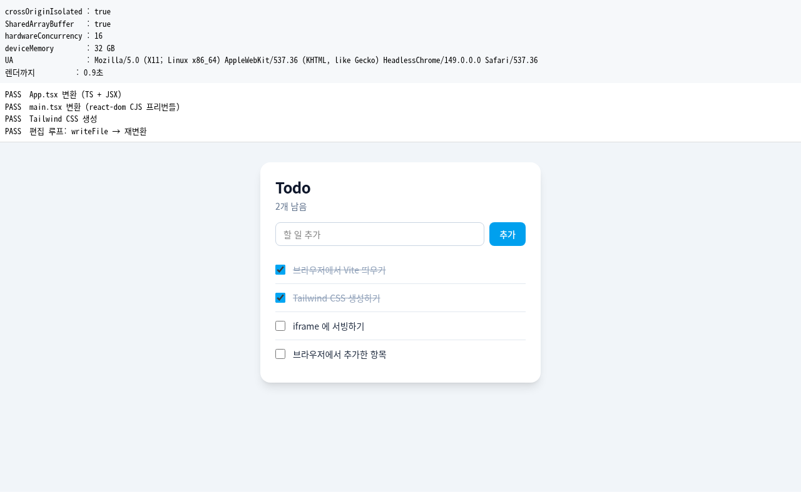

# browser-webapp-runtime

Vite 8 툴체인을 **브라우저 워커 안에서** 돌린다. React / Tailwind / TypeScript 앱을
서버 없이 브라우저에서 개발·실행하는 것이 목표.

> **상태: 동작함.** 평범한 Vite + React + Tailwind + TypeScript Todo 앱이
> **손댄 곳 하나 없이** 브라우저 안에서 빌드되고 iframe 에 서빙된다.
> 서버는 없다. `npm run test:browser` 로 실제 Chrome 에서 검증한다.

## 왜 이게 가능해졌나

[browser-vite](https://www.npmjs.com/package/browser-vite) 는 2022년 4월 (Vite 2.7 기준)
이후로 멈춰 있다. 그때는 Vite 의 의존성이 60개에 esbuild 를 `child_process` 로 띄우는
구조라 포크가 불가피했다.

Vite 8 의 런타임 의존성은 **5개**고, 네이티브인 것들이 전부 공식 wasm 트윈을 갖고 있다:

| Vite 8 의존성 | 브라우저 대체재 | 비고 |
| --- | --- | --- |
| `rolldown@~1.1.4` | `@rolldown/browser` | 공식, 버전 일치, MIT |
| `lightningcss@^1.32.0` | `lightningcss-wasm` | 버전 일치 |
| `postcss`, `picomatch`, `tinyglobby` | 그대로 | 순수 JS |
| `fsevents` | — | optional, 제외 |
| `esbuild` | — | Vite 8 에선 peerDependency (선택) |

그래서 **포크가 아니라 alias + 셤 레이어**로 접근한다.

## 검증 현황

Chrome 149 / 워커 / COOP·COEP 적용 상태에서 실측:

| 항목 | 결과 |
| --- | --- |
| `crossOriginIsolated` / SAB / 중첩 Worker | ✅ 전부 true |
| `lightningcss-wasm` init + transform | ✅ `.a,.b{color:red}` (실제 최적화됨) |
| `@rolldown/browser` 번들 (가상 모듈) | ✅ `var v_entry_default = 42` (상수 접기까지) |
| `@tailwindcss/oxide-wasm32-wasi` 로드 | ✅ `Scanner, __fs, __volume` |
| memfs ↔ wasm(WASI) 파일시스템 통합 | ✅ `같은 볼륨인가? true` |
| **Vite 8 `createServer({ middlewareMode })`** | ✅ **부팅됨** |
| `pluginContainer.resolveId` | ✅ `/src/main.tsx` → `/app/src/main.tsx` |
| **`transformRequest('/src/main.tsx')`** | ✅ **`export const hello: string = "world"` → `export const hello = "world";`** |
| 플레인 CSS `transformRequest` | ✅ Vite CSS 파이프라인 정상 |
| **Tailwind v4 CSS 생성 (Vite 파이프라인 경유)** | ✅ 13,103바이트 — `min-h-screen`/`bg-slate-100`/`rounded-2xl`/`bg-sky-500`/`line-through`/`divide-y` |
| App.tsx 변환 (TS + JSX) | ✅ JSX변환=true 타입제거=true |
| main.tsx 의 react-dom 해석 | ✅ `__vite__cjsImport0_reactDom_client` — **optimizeDeps 가 브라우저에서 React(CJS)를 프리번들** |
| **Todo 앱이 iframe 에 렌더 + Tailwind 스타일** | ✅ 버튼 배경 `oklch(0.685 0.169 237.323)` (= bg-sky-500), radius 8px |
| **React 상호작용 (항목 추가)** | ✅ |

`npm run test:browser` 로 전부 통과 (`test/browser/screenshot.png` 참고).



## 성능 (Chrome 149, localhost, 캐시 없음)

```
콜드 스타트 (Chrome 149, localhost, 캐시 없음)
  워커 부팅 (셤+시딩)           211ms
  memfs 시딩                      4ms
  vite: createServer            186ms
  App.tsx 변환 (TS+JSX)         103ms
  main.tsx (React 프리번들 포함) 255ms   ← optimizeDeps 가 CJS React 를 씹는 구간
  tailwind CSS 생성              97ms
  ─────────────────────────────────
  실제 연산 합계               ~860ms
  페이지 열기 → 렌더 완료        1.6초   ← 나머지는 wasm 다운로드/인스턴스화

툴체인 다운로드 (26개 파일)
  비압축 22.1 MB  →  gzip 5.5 MB
    3.17 MB gz   rolldown-binding.wasm32-wasi.wasm   ← 58%
    1.53 MB gz   worker.js (Vite + 셤 + Tailwind + 테스트/앱 소스)
    0.34 MB gz   node.js
```

자원 사용 (빈 Chrome 대비 델타, Todo 앱 렌더 완료 시점)
```
RSS  +641 MB      PSS  +423 MB
CPU  +2.7초 (전 코어 합산)      유휴 시 +0.00초/5초
```

**메모리가 무겁다.** rolldown 의 wasm 이 1 GiB 를 예약하는데 Node 와 달리
브라우저에서는 그게 상당 부분 물리 메모리로 잡힌다. 데스크톱은 괜찮지만
모바일은 이 숫자로 어렵다 — iOS Safari 검증이 필요하다.

대부분이 `.wasm` 이라 immutable 캐시가 잘 먹는다 — 두 번째 방문부터는 1.6초의
상당 부분이 사라진다. `worker.js` 에는 지금 테스트 코드와 Todo 앱 소스가 같이
들어있어서 실제 제품에선 더 작다. Brotli 를 쓰면 wasm 이 gzip 대비 15~20% 더 준다.

**HMR 은 안 붙였다.** 서버가 살아있으므로 편집 시 바뀐 파일만 다시 변환된다
(`.tsx` 하나 ≈ 100ms, iframe 리로드 포함 200~300ms 예상). HMR 의 이점은 속도가
아니라 **상태 보존**이다 — 리로드하면 앱 상태가 날아간다. 거슬리면 그때
`ws` → BroadcastChannel 로 얹으면 된다 (`server.hot` 은 이미 살아있다).

## 알아낸 것들

### SharedArrayBuffer 는 피할 수 없다 (Tailwind v4 를 쓰는 한)

wasm 빌드 툴체인에 따라 갈린다. napi-rs/emnapi 로 빌드된 Rust wasm 은 전부
`wasi.thread-spawn` 을 import 하고, 그건 공유 메모리를 스펙상 강제한다.

| 패키지 | 빌드 | 스레드 | SAB |
| --- | --- | --- | --- |
| `@rolldown/browser` (10.4M) | napi-rs/emnapi | `wasi.thread-spawn` | **필요** |
| `@oxc-transform/binding-wasm32-wasi` (3.2M) | napi-rs/emnapi | `wasi.thread-spawn` | **필요** |
| `@tailwindcss/oxide-wasm32-wasi` (1.7M) | napi-rs/emnapi | `wasi.thread-spawn` | **필요** |
| `esbuild-wasm` (14M) | Go | 없음 | 불필요 |
| `lightningcss-wasm` (16M) | wasm-bindgen | 없음 | 불필요 |

Vite 6 + esbuild-wasm 으로 내려가면 rolldown 쪽 SAB 요구는 사라지지만,
**Tailwind v4 의 oxide 가 혼자서 SAB 를 강제**하므로 Vite 버전과 무관하게 필요하다.
탈출구는 Tailwind v3(순수 JS) 뿐.

→ 결론: `Cross-Origin-Opener-Policy: same-origin` +
`Cross-Origin-Embedder-Policy: credentialless` 를 걸고 간다. 자체 도메인의
독립 앱이면 비용은 사실상 없다. 남의 사이트에 임베드해야 하면 얘기가 달라진다.

### 메모리: Node 에선 공짜지만 **브라우저에선 아니다** ⚠️

먼저 실측 결과부터 (Chrome 149, Todo 앱 렌더 완료 시점, 빈 Chrome 대비 델타):

```
RSS  +641 MB   (실제 물리 메모리)
PSS  +423 MB   (공유 페이지를 배분한 값 — 더 정직하다)
CPU  +2.7초    (전 코어 합산. wall clock 1.6초이므로 평균 ~1.7 코어)
유휴 시 CPU     +0.00초 / 5초   ← 백그라운드 소모 없음

performance.measureUserAgentSpecificMemory():
  총 1,121 MB — 그중 1,115 MB 가 DedicatedWorkerGlobalScope
```

**아래 Node 측정은 브라우저에 그대로 적용되지 않는다.** Node/V8 에서는
1 GiB 예약이 lazy commit 되어 RSS 가 +1.6 MB 였지만, 브라우저에서는 실제로
수백 MB 가 물리 메모리로 잡힌다. 예약이 공짜가 아니다.

데스크톱에서는 문제없지만 **모바일에서는 이 숫자로는 어렵다.**

#### `initial` 을 낮춰도 소용없다 (실측 확인)

`rolldown-binding.wasi-browser.js` 는 tarball 안의 평범한 JS 라서 패치할 수 있다
(`src/patch-rolldown-wasm.ts`). 1 GiB 예약이 범인일 거라 보고 스윕해봤다:

| 설정 | RSS | PSS | 앱 동작 |
| --- | --- | --- | --- |
| 원본 (`initial: 16384` = 1 GiB, `asyncWorkPoolSize: 4`) | +625 MB | +418 MB | ✅ |
| `initial: 256` (16 MiB), pool 4 | +610 MB | +403 MB | ✅ |
| `initial: 256` (16 MiB), pool 0 | +641 MB | +423 MB | ✅ |

**1 GiB → 16 MiB 로 낮췄는데 15 MB 밖에 안 줄었다.** 즉 641 MB 는 예약이 아니라
**rolldown 이 실제로 만지는 메모리**다. 밖에서 손댈 수 있는 게 아니다.

부수적으로 확인된 것 두 가지:
- **emnapi 의 grow 경로는 멀쩡하다.** 16 MiB 에서 600 MB 까지 늘려가며 정상
  동작하고 속도도 같다 (1.6초, transform 93ms). 이건 미지수였는데 풀렸다.
- **`asyncWorkPoolSize: 0` 도 잘 된다.** emnapi 소스상 `<= 0` 이면
  `singleThreadAsyncWork = true` 가 되어 워커 풀 없이 돈다. 다만 이득도 없다.

모바일을 열려면 rolldown 자체가 가벼워지거나, esbuild-wasm(Go, 스레드 없음)
기반의 Vite 6 으로 내려가는 수밖에 없어 보인다.

### (참고) Node/V8 에서의 메모리 거동

`@rolldown/browser` 는 `new WebAssembly.Memory({ initial: 16384, maximum: 65536, shared: true })`
로 1 GiB 를 잡는 것처럼 보인다. 공유 메모리는 grow 시 이동이 불가능해서 주소공간을
미리 선점해야 하기 때문이고, napi-rs 템플릿은 "그럴 바엔 크게 잡고 grow 를 안 한다"를 택했다.

실측 (Node / V8):

```
1 GiB shared Memory 생성만  →  RSS +1.6 MB      (순수 주소공간 예약)
 16 MB 터치                 →  RSS  17.9 MB
256 MB 터치                 →  RSS 266.0 MB     (만진 만큼만 붙음)

dev 핫패스 (transform)      →  RSS ~130 MB
풀 프로덕션 번들 피크        →  RSS  287 MB      (2565 모듈 전부)
.tsx 1장 transform          →  0.06 ms          (200회 평균, wasm 경유)
풀 번들                     →  730 ms           (네이티브 250ms 대비 3배)
```

Node/V8 에서 `initial` 은 lazy commit 되는 가상 주소공간이라 1 GiB 를 태우지 않는다.
**하지만 브라우저에서는 그렇지 않다** — 위 실측 참고. 이 표는 Node 기준 참고치일 뿐이다.

### `process` 셤은 최소로 — 순진한 셤이 없느니만 못하다

`version` / `versions.node` 를 넣으면 emnapi 가 Node 로 오인해서 `worker_threads`
경로를 타고 `TypeError: worker.on is not a function` → Rust 패닉으로 죽는다.
셤이 아예 없을 때보다 크게 터진다. `src/shims/process.ts` 주석 참고.

### Vite 8 이 실제로 쓰는 node API 는 이게 전부다

```
node:fs           default, `* as ns`, { existsSync, readFileSync }
node:fs/promises  default, { constants }
node:path         default, { basename, dirname, extname, isAbsolute, join,
                             normalize, posix, relative, resolve, sep }
node:events       { EventEmitter }
node:url          { URL, fileURLToPath, pathToFileURL }
node:util         { format, formatWithOptions, inspect, parseEnv, promisify,
                    stripVTControlCharacters }
node:perf_hooks   { performance }
node:module       { Module, builtinModules, createRequire }   ← 유일하게 껄끄러움
```

`node:http` / `node:net` / `node:tls` / `node:child_process` 는
`server.middlewareMode: true` 로 켜면 import 만 되고 호출되지 않는다.
`middlewareMode` 는 원래 Express 에 Vite 를 끼워넣으라고 있는 옵션이고,
켜면 Vite 가 http 서버를 만들지 않는다.

### Vite 의 node 빌트인 스텁은 조용히 거짓말한다

```js
//#region __vite-browser-external
var require___vite_browser_external = __commonJSMin((exports, module) => {
  module.exports = {};        // ← 빈 객체. 던지지 않는다
});
```

빌드는 통과하고 런타임에 `fs.readFileSync is not a function` 으로 터진다.
**빌드 성공은 아무것도 보장하지 않는다.**

### alias 순서 — `node:fs` 가 `node:fs/promises` 를 삼킨다

Vite 의 문자열 alias 는 접두사 매칭이다. 긴 specifier 를 먼저 넣어야 한다.
`src/alias.ts` 가 이 순서를 지킨다.

### 의존성은 브라우저에서 resolve 하지 않는다

고정 패키지 셋을 쓰면 로컬에서 진짜 pnpm 이 269개를 2.5초에 resolve 한다.
그러면 resolver / semver / packument / peer deps / integrity / os·cpu 필터가 전부 사라진다.

크기 (React + Tailwind + Lucide + Recharts + TanStack Router + Radix + AI SDK):

```
node_modules (디스크)                  442 MB
tar.gz 가공 없음                        86 MB
tar.gz 가지치기 (툴체인·tfjs·맵 제외)    11 MB   ← memfs 스냅샷
optimizeDeps 프리번들                  0.9 MB gzip  ← dev 에서 브라우저가 받는 것
전체 앱 빌드 (다 import)               268 KB gzip
```

참고로 npm packument 는 `react` 하나가 gzip 1.15 MB 다. 브라우저에서 트리를 걸으면
30개 패키지에 30 MB 를 쓴다. 꼭 동적 resolve 가 필요해지면 jsDelivr 이
semver range 를 해석해준다 (`cdn.jsdelivr.net/npm/react@^19.0.0/package.json` → 1,248 B).

### Tailwind 의 `Scanner.scan()` 은 브라우저에서 **구조적으로 불가능**하다

`@tailwindcss/oxide-wasm32-wasi` 의 `scan()` 은 fs 를 걷느라 rayon 스레드를 띄운다.
napi-rs 의 wasi-browser 템플릿 구조상 두 컨텍스트 모두 막힌다:

```
메인 스레드 → RuntimeError: Atomics.wait cannot be called in this context
             (브라우저가 메인 스레드 블로킹을 금지)
워커       → 데드락
```

워커에서의 데드락은 이 구조 때문이다:

```js
// 부모 (tailwindcss-oxide.wasi-browser.js)
onCreateWorker() {
  const worker = new Worker(new URL('./wasi-worker-browser.mjs', import.meta.url), ...)
  worker.addEventListener('message', __wasmCreateOnMessageForFsProxy(__fs))  // 내 이벤트루프로 답하겠다
}
// 자식 (wasi-worker-browser.mjs)
const fs = createFsProxy(__memfsExported)   // fs 호출을 부모에게 postMessage
```

부모가 "내 이벤트루프로 자식의 fs 요청에 답하겠다" 고 등록해놓고 곧바로
`Atomics.wait()` 으로 그 이벤트루프를 멈춘다. **요구사항이 상호배타적이라 설정으로
풀리지 않는다.** 파일이 없으면 즉시 반환하고, 있으면 멈춘다.

**우회**: 데드락은 fs 를 걷는 `scan()` 에만 있다. `scanFiles(contents)` 는 내용을
직접 받으므로 fs 도 스레드도 안 건드리고 잘 돈다:

```
scanFiles() 반환: 8개 — bg-sky-500,class,flex,hi,items-center,p-4,rounded-lg,text-white
```

그래서 `src/tailwind.ts` 는 **fs 걷기를 JS 로 하고**(memfs 는 동기라 공짜다) 후보
추출만 wasm 에 맡긴 뒤 `tailwindcss` 의 `compile().build(candidates)` 로 CSS 를 만든다.
`@tailwindcss/vite` 와 `@tailwindcss/node` 를 통째로 대체한다.

### oxide 를 버리면 Tailwind 가 순수 JS 로 돈다 ← **해결됨**

`@tailwindcss/oxide-wasm32-wasi` 는 브라우저에서 못 쓴다:

- `scan()` 은 fs 를 걷느라 rayon 스레드를 띄우는데, 메인 스레드에서는
  `Atomics.wait cannot be called in this context` 로 죽고, 워커에서는 데드락이다
  (부모가 자식의 fs 요청에 답하겠다고 등록해놓고 곧바로 `Atomics.wait()` 으로
  자기 이벤트루프를 멈춘다 — 요구사항이 상호배타적이다).
- `scanFiles(contents)` 는 fs 를 안 건드려서 그 데드락은 피하지만, **oxide wasm 을
  로드하는 것만으로 rolldown 과 충돌해 멈춘다** (원인 미상. 별도 워커로 분리해도
  안 됐다. 모듈 평가와 wasm 인스턴스화까지는 정상인데 `self.onmessage` 가 안 불렸다).

**해법: oxide 를 아예 안 쓴다.** `compile().build(candidates)` 는 **모르는 후보를
조용히 무시**하므로 **과추출이 안전하고 누락만 위험하다.** 정규식으로 게걸스럽게
긁으면 된다. 실측:

```
oxide 후보: 29개 → CSS 9,962 바이트
JS   후보: 41개 → CSS 9,962 바이트     ← 과추출했는데 결과 동일
두 CSS 가 동일한가? ✅ 완전히 같음 (바이트 단위)
```

같이 사라진 것: 블로커, **Tailwind 쪽 SAB 요구**, wasm 1.7 MB.
구현은 `src/extract-candidates.ts` — 30줄이다.

함정 하나: 처음엔 따옴표·`=`·꺾쇠를 문자 클래스에 넣었다가 `className="flex` 를
한 토큰으로 삼켜서 `.flex` 를 통째로 놓쳤다. 따옴표는 **구분자**여야 한다.
다만 arbitrary value 안에는 따옴표가 들어갈 수 있어서(`content-['hi']`)
대괄호 패스를 따로 돌려 union 한다.

### `@tailwindcss/browser` 는 DOM 스캐너다 — 이 용도엔 안 맞는다

```js
querySelectorAll('[class]')                          // 렌더된 class 속성을 긁는다
querySelectorAll('style[type="text/tailwindcss"]')   // 사용자 CSS 도 받아준다
MutationObserver → document.head.append(<style>)
wasm/oxide/Atomics/SharedArrayBuffer: 0건
```

파일 하나 272 KB, 의존성 0. **Tailwind 가 순수 JS 로 돈다는 증거**이긴 하다.
하지만 소스가 아니라 **렌더된 DOM** 을 스캔하므로:

- 아직 마운트 안 된 컴포넌트(조건부 렌더링/라우팅)의 클래스는 누락
- 첫 페인트에 CSS 가 없어 깜빡임
- 소스를 스캔하는 프로덕션 빌드와 **결과가 갈린다**

프리뷰용으론 쓸 만하지만 "수정 없이 그대로 돌아간다" 가 목표면 함정이다.

### `@tailwindcss/node` 는 버그라서 뺀 게 아니라 **Node 어댑터**라서 뺐다

```
registerHooks ×2   ← Node 의 ESM 로더 훅. 브라우저에 대응물이 없다
createRequire ×1   pathToFileURL ×2   require.cache ×1
```

Tailwind 의 순수 JS 코어는 `tailwindcss` 의 `compile(css, { loadStylesheet, loadModule })`
이고, 그 훅들이 곧 호스트를 꽂는 자리다. `@tailwindcss/node` 는 거기에 Node 를 꽂은 것이고
`src/tailwind.ts` 는 memfs 를 꽂은 것이다. 대체이지 우회가 아니다.

### `@rolldown/browser` 의 wasi-browser 는 워커를 상정하지 않는다

```js
// onCreateWorker 안
worker.addEventListener('message', (event) => {
  if (event.data?.type === 'error')
    window.dispatchEvent(new CustomEvent('napi-rs-worker-error', ...))  // 워커엔 window 가 없다
})
```

에러 보고 경로가 워커에서 터지므로 **진짜 에러가 `window is not defined` 로 가려진다.**
디버깅할 때 이걸 먼저 의심할 것.

### workerd 는 테스트 타깃이 될 수 없다

```json
{ "SharedArrayBuffer": "function",
  "WebAssembly.Memory shared:true": "OK",
  "Worker": "undefined" }
```

SAB 는 오히려 있다. 하지만 `Worker` 가 없어서 `wasi.thread-spawn` 이 불가능하고,
CF Workers 의 메모리 상한 128 MB 는 측정된 130–287 MB 와 맞지 않는다.
그리고 애초에 브라우저가 아니라서 초록불이 떠도 아무 보장이 없다.
테스트는 Playwright + 실제 Chrome 으로 한다 (`test/browser/`).

## 개발

```bash
npm install
npm run test:browser     # COOP/COEP 걸고 실제 Chrome 워커에서 검증
```

## 라이선스

MIT
